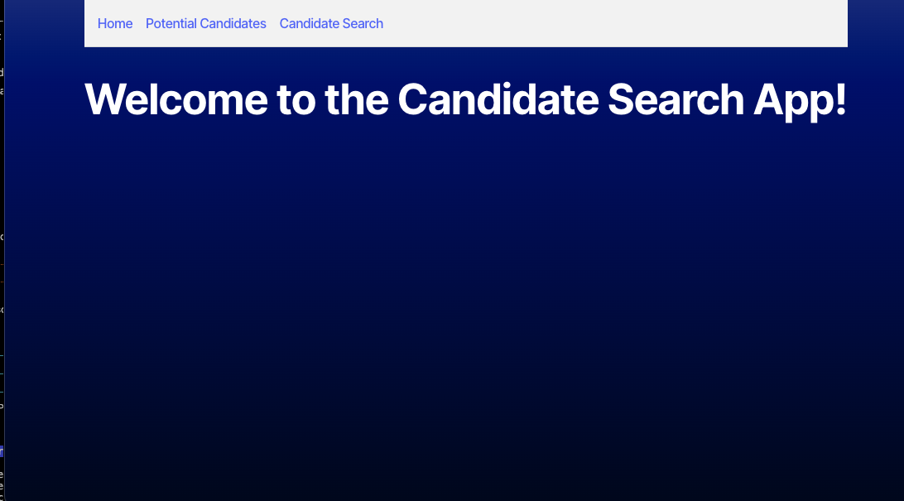
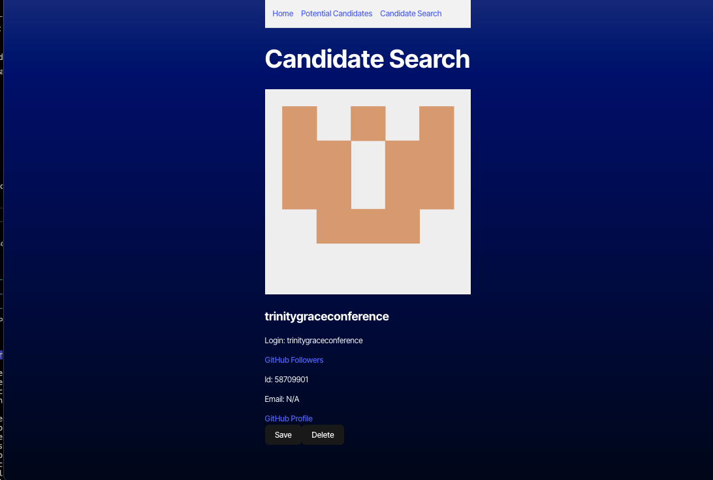
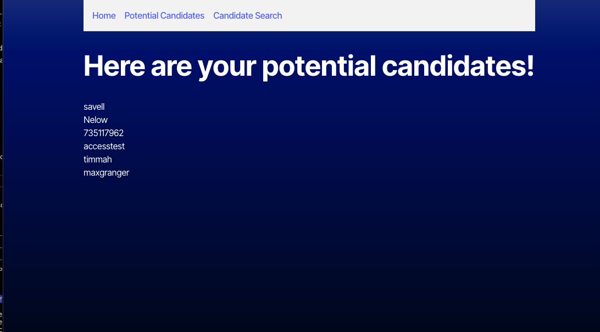
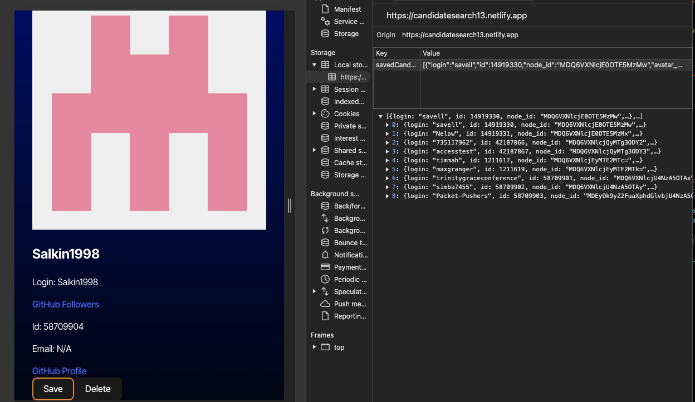
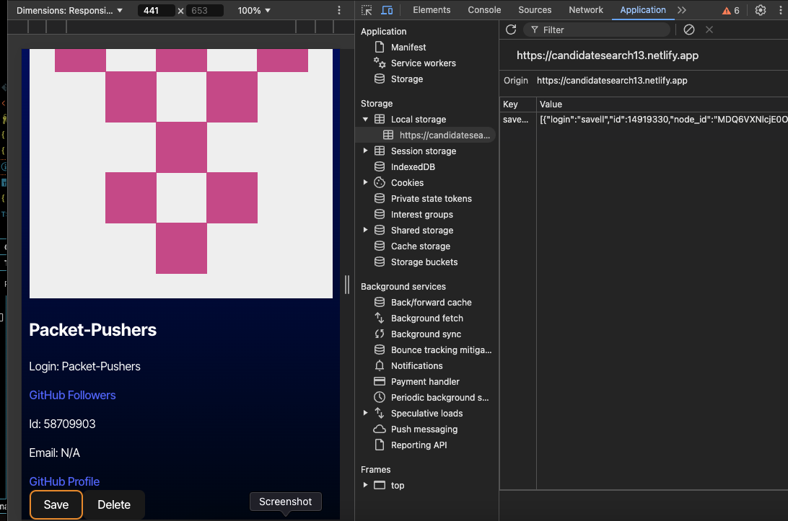
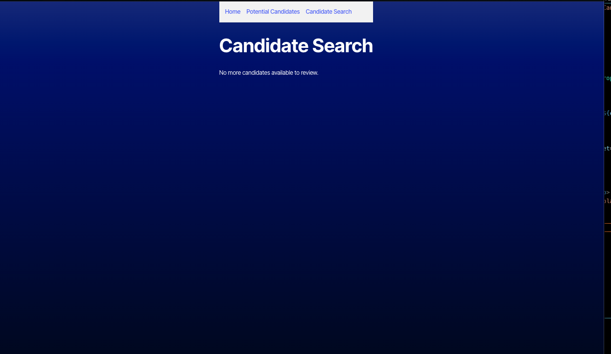

# Candidated Search 

<div align="center">

</div>

<div align="center">
 
  <h3 align="center">MC Foster Portfolio</h3>

  <p align="center">
about app

  <br />
    <a href=""><strong>Explore the docs »</strong></a>
  </p>
</div>

  [Netlify Deployment- Candidate Search](https://app.netlify.com/sites/candidatesearch13/overview#:~:text=https%3A//candidatesearch13.netlify.app)

      
 
<details>
  <summary>Table of Contents</summary>
  <ol>
    <li>
      <a href="#about-the-project">About The Project</a>
      <ul>
        <li><a href="#built-with">Built With</a></li>
      </ul>
    </li>
    <li>
      <a href="#getting-started">Getting Started</a>
      <ul>
        <li><a href="#installation">Installation</a></li>
      </ul>
    </li>
    <li><a href="#usage">Usage</a></li>
    <li><a href="#roadmap">Roadmap</a></li>
    <li><a href="#contributing">Contributing</a></li>
    <li><a href="#license">License</a></li>
    <li><a href="#contact">Contact</a></li>
    <li><a href="#acknowledgments">Acknowledgments</a></li>
  </ol>
</details>


## About The Project

This project is a candidate search application designed to help users identify and save the best candidates for potential hiring. The application displays detailed information about candidates, including their username, avatar, email, followers, and profile URL. Users can save a candidate to a list of potential hires by clicking a "+" button or skip to the next candidate using a "-" button. If no candidates are available to review, a message is displayed. The list of saved candidates is viewable on a dedicated page, persists across page reloads, and includes all relevant candidate details.


 










This project was built using React, JS, CSS, VS code & Vite

### Built With

<div align="center">


[](https://javascript.info/)
[](https://typecript.info/)
[](https://developer.mozilla.org/en-US/docs/Web/CSS)
[](https://code.visualstudio.com/docs)
[](https://react.info/)
[](https://vite.info/)

</div>


## Getting Started

Once completely built, this application will function as a deployed app on Netlify.

### Local Installation / Testing

1. Clone the rep

```
git clone 
```

2. Install dependencies

```
npm i
```

3. Launch the app in development environment

```
npm run build
npm run dev
```

4. It will show running on netlify


#### MVP


- [ ] Front End

  - [ ] Landing Page
    - [ ] Routing
    - [ ] Styling


<!-- #### Future Development

- [ ]
- [ ]
- [ ] -->


## Contributing

Contributions are what make the open source community such an amazing place to learn, inspire, and create. Any contributions you make are **greatly appreciated**.

If you have a suggestion that would make this better, please fork the repo and create a pull request. You can also simply open an issue with the tag "enhancement".
Don't forget to give the project a star! Thanks again!

1. Fork the Project
2. Create your Feature Branch (git checkout -b feature/AmazingFeature)
3. Commit your Changes (git commit -m 'Add some AmazingFeature')
4. Push to the Branch (git push origin feature/AmazingFeature)
5. Open a Pull Request


## License

This project is licensed under the MIT license.

[](https://opensource.org/licenses/MIT)

## Contact


[Marie-Chantal Foster](mariechantalfoster@gmail.com) 

Project Links:

[Github Repository](https://github.com/MCFoster007/Candidate-Seach-13)

[Github Pages Deployment](https://mcfoster007.github.io/Candidate-Seach-13/)


[Netlify Deployment](https://candidatesearch13.netlify.app)


## Acknowledgments
Thank you to my tutors and instructor who helped me and guided me.


